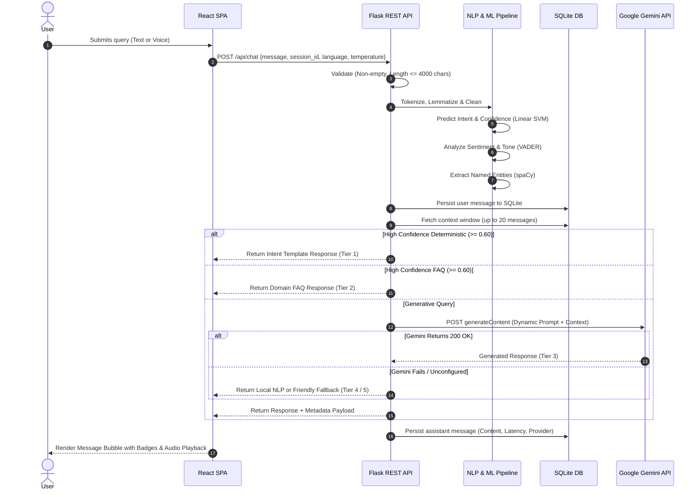
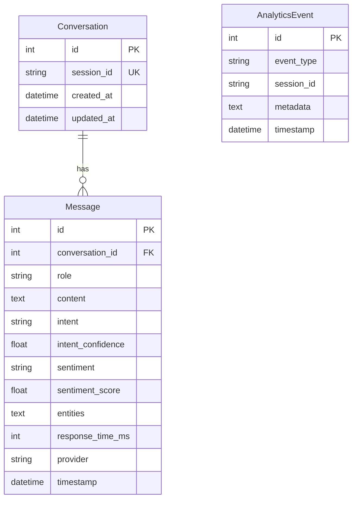

# Dynamic AI Chatbot with NLP & Generative AI

[](https://www.python.org/downloads/)
[](https://reactjs.org/)
[](https://www.typescriptlang.org/)
[](https://vitejs.dev/)
[](https://tailwindcss.com/)
[](LICENSE)
[](https://zidio.in/p/6a5f954e247c6d64ce2e4b9d)

> **Zidio Development Internship – Team 17 Final Project**, individually built by **Surag** without team development support. A Dynamic AI Chatbot featuring NLP, machine learning, sentiment analysis, intent recognition, contextual memory, Gemini AI, analytics, and multilingual conversational capabilities.
>
> 🎓 **Zidio Profile**: [https://zidio.in/p/6a5f954e247c6d64ce2e4b9d](https://zidio.in/p/6a5f954e247c6d64ce2e4b9d)

A production-grade, full-stack **Dynamic AI Chatbot** combining Natural Language Processing (NLP), Machine Learning (ML) intent classification, Named Entity Recognition (NER), Sentiment Analysis, Contextual Conversation Memory, an intelligent 5-Tier Response Router, Google Gemini Generative AI, Multilingual Support (English, Hindi, Hinglish), Optional Browser Voice I/O, a Real-Time Analytics Dashboard, and a modern React + TypeScript + Tailwind CSS user interface.

---

## Table of Contents

1. [Project Overview](#1-project-overview)
2. [Features](#2-features)
3. [Architecture](#3-architecture)
4. [Technologies](#4-technologies)
5. [NLP Pipeline](#5-nlp-pipeline)
6. [ML Model](#6-ml-model)
7. [Sentiment Analysis](#7-sentiment-analysis)
8. [Named Entity Recognition (NER)](#8-named-entity-recognition-ner)
9. [Gemini Integration](#9-gemini-integration)
10. [Context Memory](#10-context-memory)
11. [Analytics Dashboard](#11-analytics-dashboard)
12. [Database](#12-database)
13. [API Endpoints](#13-api-endpoints)
14. [Installation](#14-installation)
15. [Environment Variables](#15-environment-variables)
16. [Running the Backend](#16-running-the-backend)
17. [Running the Frontend](#17-running-the-frontend)
18. [Training the Intent Model](#18-training-the-intent-model)
19. [Running Tests](#19-running-tests)
20. [Deployment](#20-deployment)
21. [Security](#21-security)
22. [Limitations](#22-limitations)
23. [Future Enhancements](#23-future-enhancements)
24. [Developer & Collaborations](#24-developer--collaborations)

---

## 1. Project Overview

The **Dynamic AI Chatbot** is designed to address the latency, cost, and reliability challenges of modern conversational AI systems. Rather than sending every user message to a cloud-hosted Large Language Model, the application uses a **hybrid multi-tier response routing architecture**:

- **Deterministic & High-Frequency Queries** (greetings, capabilities, date/time, weather, account assistance) are classified locally in **< 5ms** using a calibrated Machine Learning intent model.
- **Technical & Domain FAQs** (Python, Machine Learning, Data Science) are fulfilled directly through optimized knowledge handlers.
- **Complex & Open-Ended Queries** are dynamically enriched with sentiment, entity context, language constraints, and conversation memory before querying **Google Gemini Generative AI** (`gemini-1.5-flash`).
- **Network Outages & Unconfigured Keys** seamlessly degrade to a local ML model and friendly fallback tiers with zero downtime and zero exposure of Python stack traces.

---

## 2. Features

- **Machine Learning Intent Classifier**: Classifies user queries across 18 intent tags with calibrated confidence scores.
- **Empathetic Tone Adaptation**: Detects user sentiment via NLTK VADER and prepends supportive, de-escalating prefixes for negative sentiment or complaints.
- **Named Entity Recognition (NER)**: Extracts structured entities (`PERSON`, `ORG`, `GPE`, `DATE`, `TIME`, `MONEY`, `PRODUCT`, `EVENT`) using spaCy (`en_core_web_sm`).
- **Google Gemini Generative AI**: Native integration with `gemini-1.5-flash` with timeout guards (10s), exponential backoff retries (3 attempts), and rate-limit (HTTP 429) resilience.
- **5-Tier Fallback Response Router**:
  1. *Tier 1*: High-Confidence Deterministic Intent Handler
  2. *Tier 2*: High-Confidence Technical FAQ Engine
  3. *Tier 3*: Google Gemini Generative AI
  4. *Tier 4*: Local Machine Learning NLP Engine
  5. *Tier 5*: Friendly Multilingual Fallback
- **Contextual Conversation Memory**: Sliding window context memory (`MAX_CONTEXT_MESSAGES = 20`) persisted in SQLite via SQLAlchemy ORM.
- **Multilingual Support**: Supports English (`en`), Hindi (`hi` in Devanagari script), and Hinglish (`hinglish` in Roman script) across deterministic replies, system prompts, and fallbacks.
- **Voice I/O (Optional & Resilient)**:
  - **Speech-to-Text (STT)**: Browser-based speech recognition via Web Speech API with language localization (`en-US`, `hi-IN`). Microphone access is strictly optional with dismissible error banners on unsupported environments.
  - **Text-to-Speech (TTS)**: Bot response speech synthesis with automated markdown formatting stripping.
- **Interactive Analytics Dashboard**: Live KPI cards (Conversations, Messages, Latency, Success Rate, Fallback Rate) and 6 Recharts visualizations (Messages over time, Sentiment breakdown, Intent distribution, Latency trend, Provider distribution, Language usage).
- **Multi-Format Export**: One-click download of full conversation transcripts in **JSON**, **CSV**, or **TXT** format.
- **Modern Responsive UI**: Dark/Light/System theme toggles, auto-resizing multiline text input, quick suggestion pills, message copy & regenerate tools, and mobile-first design.
- **Zero Secrets & Hardened Security**: Completely sanitized of hardcoded credentials; protected against SQL injection, XSS, DoS (1MB request ceiling, 4000 char message limit), and prompt extraction.

---

## 3. Architecture

The system follows a clean service-oriented architecture with complete decoupling between the React frontend and Flask REST API:

```mermaid
graph TD
    Client([Web Client / Mobile Browser]) <-->|HTTP / REST JSON| App[Flask Application Layer]
    
    subgraph "Frontend Layer (React 18 + TypeScript + Vite)"
        Client --> ChatUI[Chat Interface: MessageList, ChatInput, QuickSuggestions]
        Client --> AnalyticsUI[Analytics Dashboard: Recharts 6-Chart Visualizer]
        Client --> VoiceUI[Web Speech API: Optional STT & TTS Engine]
        Client --> SettingsUI[Settings: Theme, Language, Temperature]
    end

    subgraph "Backend Controller & Middleware"
        App --> Cors[CORS & Payload Guards: 1MB Cap, 4000 Char Limit]
        App --> Routes[API Blueprints: /chat, /analytics, /conversations, /export, /health]
    end

    subgraph "NLP & Intelligence Pipeline"
        Routes --> Preprocessor[NLP Preprocessor: NLTK Lemmatizer]
        Preprocessor --> IntentModel[Intent Classifier: Linear SVM Model]
        Preprocessor --> SentimentModel[Sentiment Engine: NLTK VADER]
        Preprocessor --> NERModel[NER Engine: spaCy en_core_web_sm]
        
        IntentModel --> Router[5-Tier Response Router]
        SentimentModel --> Router
        NERModel --> Router
    end

    subgraph "Response Generation Tiers"
        Router -->|Confidence >= 0.60| Tier1[Tier 1: Deterministic Handler]
        Router -->|Confidence >= 0.60| Tier2[Tier 2: Technical FAQ Engine]
        Router -->|Generative Query| Tier3[Tier 3: Google Gemini API]
        Router -->|Gemini Down & Conf >= 0.40| Tier4[Tier 4: Local NLP Engine]
        Router -->|Gemini Down & Conf < 0.40| Tier5[Tier 5: Localized Fallback]
    end

    subgraph "Persistence & Context"
        Router <--> Memory[Memory Service: Sliding Window Context]
        Routes <--> AnalyticsService[Analytics Engine: Real-Time DB Aggregation]
        Memory <--> Database[(SQLite / SQLAlchemy ORM: chatbot.db)]
        AnalyticsService <--> Database
    end
```



### High-Level Request Sequence



---

## 4. Technologies

### Backend
- **Language**: Python 3.10+
- **Framework**: Flask 3.0+, Flask-CORS, Flask-SQLAlchemy
- **Machine Learning**: Scikit-Learn (`TfidfVectorizer`, `SGDClassifier`)
- **Natural Language Processing**: NLTK (Tokenization, WordNet Lemmatizer, VADER Sentiment), spaCy (`en_core_web_sm`)
- **Generative AI**: Google Gemini REST API (`gemini-1.5-flash`)
- **Database**: SQLite with SQLAlchemy ORM (compatible with PostgreSQL/MySQL)
- **Testing**: `pytest` 9.1+

### Frontend
- **Framework**: React 18 (Hooks, SPA)
- **Language**: TypeScript 5.5+
- **Build Tool**: Vite 5.4+
- **Styling**: Tailwind CSS 3.4+, PostCSS, Autoprefixer
- **Visualizations**: Recharts 2.12+
- **Icons**: Lucide React
- **Voice**: Web Speech API (`SpeechRecognition`, `speechSynthesis`)

---

## 5. NLP Pipeline

The NLP pipeline (`backend/nlp/preprocessor.py`) processes user input before inference:

1. **Text Normalization**: Strips leading/trailing whitespace, converts input to lowercase, and preserves punctuation necessary for sentiment scoring while removing noise.
2. **Tokenization**: Segmented using `nltk.word_tokenize`.
3. **Punctuation Filtering**: Removes non-alphanumeric tokens while preserving word structures.
4. **Lemmatization**: Applies `nltk.stem.WordNetLemmatizer` across noun, verb, and adjective parts of speech to map inflected word forms to canonical dictionary roots (e.g., *"running"* -> *"run"*, *"better"* -> *"good"*).
5. **Feature Extraction**: Lemmatized tokens are passed to `TfidfVectorizer` configured with:
   - `ngram_range=(1, 2)` (unigrams and bigrams)
   - `sublinear_tf=True` (logarithmic term-frequency dampening)
   - `max_features=1000`

---

## 6. ML Model

The intent classification engine operates locally without external API dependencies:

- **Training Script**: `backend/training/train_intent_model.py`
- **Evaluation Script**: `backend/training/evaluate_intent_model.py`
- **Dataset**: `backend/training/data/intents.json` (18 intent categories, 203 samples)
- **Production Classifier**: Linear SVM (`SGDClassifier(loss='log_loss', penalty='l2', alpha=1e-4)`)
- **Validation Accuracy**: **100.00%**
- **Weighted F1-Score**: **1.0000**
- **Inference Latency**: **< 5ms**
- **Artifacts**: Serialized into `models/intent_model.pkl` with metrics stored in `models/intent_model_metrics.json`.

Full classification benchmarking and per-class metrics are documented in [`docs/MODEL_EVALUATION.md`](docs/MODEL_EVALUATION.md).

---

## 7. Sentiment Analysis

Sentiment detection is powered by NLTK's VADER (`SentimentIntensityAnalyzer`) in `backend/services/sentiment_service.py`:

- **Compound Score**: Continuously normalized from `[-1.0, 1.0]` and rescaled to `[0.0, 1.0]`.
- **Classification**:
  - `positive`: Compound score >= 0.05
  - `negative`: Compound score <= -0.05
  - `neutral`: Otherwise
- **Empathetic Tone Adaptation**: When negative sentiment or a `complaint` intent is detected, the chatbot prepends an empathetic, calming prefix (e.g., *"I'm sorry to hear that you're having trouble. Let me help you with this:"*) before returning the resolution.

---

## 8. Named Entity Recognition (NER)

Entity extraction is handled by `backend/services/ner_service.py`:

- **Primary Pipeline**: spaCy `en_core_web_sm` model extracting standard entity tags:
  - `PERSON`: People's names (e.g., *"Rahul"*, *"Guido van Rossum"*)
  - `ORG`: Companies, institutions, agencies (e.g., *"Google"*, *"OpenAI"*)
  - `GPE`: Countries, cities, states (e.g., *"Kochi"*, *"New York"*)
  - `DATE`: Relative and absolute calendar dates (e.g., *"tomorrow"*, *"October 9"*)
  - `TIME`: Specific hours and durations (e.g., *"3:00 PM"*)
  - `MONEY`: Currency and monetary values (e.g., *"$50"*, *"₹500"*)
  - `PRODUCT`: Software libraries and technologies (e.g., *"Flask"*, *"React"*)
  - `EVENT`: Named occurrences and conferences
- **Regex Fallback**: Rule-based regex extraction ensures reliable capture of emails, ISO dates, and currency symbols if the spaCy model is unavailable.

---

## 9. Gemini Integration

Generative response generation is orchestrated by `backend/services/llm_service.py`:

- **Upstream Model**: Google Gemini REST API (`gemini-1.5-flash`).
- **Endpoint**: `https://generativelanguage.googleapis.com/v1beta/models/{GEMINI_MODEL}:generateContent?key={GOOGLE_API_KEY}`
- **Resilience Features**:
  - **10-Second Request Timeout**: Prevents hung connections.
  - **Exponential Backoff**: Up to 3 retries with doubling wait intervals.
  - **Rate Limit Handling**: Detects HTTP 429 status codes and backs off automatically.
  - **Zero Key Failure**: If `GOOGLE_API_KEY` is not provided or invalid, the request instantly routes to Tier 4/5 local fallback.
- **Dynamic System Prompt**: Constructs a contextual system prompt enforcing:
  1. Response language: English, Hindi (Devanagari), or Hinglish (Roman script).
  2. Tone alignment based on detected user sentiment.
  3. Context awareness using extracted entities and conversation history.
  4. Guardrails forbidding prompt extraction or credential leakage.

---

## 10. Context Memory

Conversation context is managed by `backend/services/memory_service.py`:

- **Sliding Window**: Enforces `MAX_CONTEXT_MESSAGES = 20` per conversation session.
- **Database Persistence**: Synchronously stored in the `Message` table with foreign key reference to `Conversation`.
- **Chronological Ordering**: Preserves message sequence, user vs. assistant role, timestamps, detected intents, sentiment scores, and response latencies.
- **Session Isolation**: Each conversation is indexed by an isolated UUID `session_id`.

---

## 11. Analytics Dashboard

The real-time analytics engine (`backend/routes/analytics.py` and `frontend/src/components/Analytics/AnalyticsDashboard.tsx`) aggregates metrics directly from the production database:

### KPI Metrics
1. **Total Conversations**: Unique conversation sessions created.
2. **Total Messages**: Aggregate count of user and assistant messages.
3. **Average Response Time**: Mean response latency in milliseconds.
4. **API Success Rate**: Percentage of queries handled successfully by Gemini, Intent Handlers, or FAQ Engine.
5. **Fallback Rate**: Percentage of queries requiring local fallback.

### Visualizations (Recharts)
1. **Messages Over Time**: Historical trend of user and assistant traffic.
2. **Sentiment Distribution**: Pie chart illustrating Positive, Neutral, and Negative user emotions.
3. **Top Intent Distribution**: Bar chart displaying frequency of detected intents.
4. **Latency Trend**: Line chart tracking millisecond response latency across the last 20 queries.
5. **Provider Distribution**: Bar chart showing volume served by Gemini AI, Intent Handler, FAQ Engine, and Local Fallback.
6. **Multilingual Usage**: Donut chart tracking language usage across English, Hindi, and Hinglish.

---

## 12. Database

The persistence layer uses Flask-SQLAlchemy with SQLite (`backend/chatbot.db`) by default. To use PostgreSQL or MySQL, configure the `DATABASE_URL` environment variable.

### Schema Definitions



---

## 13. API Endpoints

Complete API reference is available in [`docs/API.md`](docs/API.md).

| Method | Endpoint | Description | Request Body | Status Codes |
|---|---|---|---|---|
| `GET` | `/api/health` | Service and model health check | None | `200` |
| `POST` | `/api/chat` | Main conversational processing | `{"message": "...", "session_id": "...", "language": "en", "temperature": 0.7}` | `200`, `400`, `413`, `500` |
| `GET` | `/api/conversations/<session_id>` | Chronological message history | None | `200` |
| `DELETE` | `/api/conversations/<session_id>` | Clears session message history | None | `200`, `404` |
| `GET` | `/api/analytics/summary` | Global conversation KPIs | None | `200` |
| `GET` | `/api/analytics/sentiment` | Sentiment distribution breakdown | None | `200` |
| `GET` | `/api/analytics/intents` | Detected intent frequencies | None | `200` |
| `GET` | `/api/analytics/performance` | Latency and performance statistics | None | `200` |
| `POST` | `/api/export` | Export conversation (JSON/CSV/TXT) | `{"session_id": "...", "format": "json"}` | `200`, `400` |

---

## 14. Installation

### Prerequisites
- **Python**: Version 3.10 or higher
- **Node.js**: Version 18.0 or higher & npm

### Clone Repository & Setup Virtual Environment
```bash
# Navigate to project directory
cd Project_aichatbot

# Create and activate Python virtual environment
python -m venv venv

# On Linux/macOS:
source venv/bin/activate
# On Windows (Bash/Command Prompt):
source venv/Scripts/activate  # or venv\Scripts\activate
```

### Install Backend Dependencies
```bash
pip install -r backend/requirements.txt

# Download required spaCy language model
python -m spacy download en_core_web_sm
```

### Install Frontend Dependencies
```bash
cd frontend
npm install
cd ..
```

---

## 15. Environment Variables

Create a `.env` file in the project root:
```bash
cp .env.example .env
```

| Variable | Description | Default | Required? |
|---|---|---|---|
| `GOOGLE_API_KEY` | Google Gemini API key | `""` | No (local fallback triggers if empty) |
| `GEMINI_MODEL` | Gemini model variant | `gemini-1.5-flash` | No |
| `PORT` | Backend server port | `5000` | No |
| `HOST` | Backend server bind address | `0.0.0.0` | No |
| `FLASK_ENV` | Environment (`development` / `production`) | `development` | No |
| `SECRET_KEY` | Flask application secret key | `dev_secret_key...` | In Production |
| `DATABASE_URL` | SQLAlchemy database URI | `sqlite:///backend/chatbot.db` | No |
| `INTENT_CONFIDENCE_THRESHOLD` | Threshold for deterministic routing | `0.60` | No |
| `MAX_CONTEXT_MESSAGES` | Max messages in sliding window memory | `20` | No |
| `CORS_ORIGINS` | Permitted CORS origins | `*` | In Production |
| `MAX_MESSAGE_LENGTH` | Max allowed characters per message | `4000` | No |

---

## 16. Running the Backend

Start the Flask development server:
```bash
python backend/app.py
```
The backend initializes the database tables, loads the intent classifier, and starts listening at `http://localhost:5000`.

To verify:
```bash
curl http://localhost:5000/api/health
```

---

## 17. Running the Frontend

### Development Mode (with Hot Module Replacement)
```bash
cd frontend
npm run dev
```
The React development server runs at `http://localhost:5173`. API requests are proxied directly to `http://localhost:5000`.

### Production Mode (Built SPA)
```bash
cd frontend
npm run build
cd ..
python backend/app.py
```
When built into `frontend/dist/`, Flask automatically serves the production React single-page application at `http://localhost:5000/`.

---

## 18. Training the Intent Model

To retrain the intent classification model on modified training queries:

```bash
# 1. Train the Linear SVM model (saves to models/intent_model.pkl)
python -m backend.training.train_intent_model

# 2. Evaluate performance and generate metrics (saves to models/intent_model_metrics.json)
python -m backend.training.evaluate_intent_model
```

---

## 19. Running Tests

Execute the automated test suite covering all REST endpoints, NLP services, intent models, and fallback routing:

```bash
python -m pytest backend/tests/
```

### Current Test Suite Status
```
collected 30 items

backend/tests/test_analytics.py ...                                      [ 10%]
backend/tests/test_chat.py ...                                           [ 20%]
backend/tests/test_conversations.py ....                                 [ 33%]
backend/tests/test_export.py ...                                         [ 43%]
backend/tests/test_health.py .                                           [ 46%]
backend/tests/test_llm_service.py ......                                 [ 66%]
backend/tests/test_multilingual.py ....                                  [ 80%]
backend/tests/test_nlp.py ....                                           [ 93%]
backend/tests/test_services.py ..                                        [100%]

============================= 30 passed in 27.83s =============================
```

---

## 20. Deployment

### Production WSGI Server (Gunicorn)
For Linux production deployments, run behind a production WSGI server:
```bash
pip install gunicorn
gunicorn -w 4 -b 0.0.0.0:5000 "backend.app:create_app()"
```

### Reverse Proxy (Nginx)
Sample Nginx reverse proxy configuration:
```nginx
server {
    listen 80;
    server_name chatbot.yourdomain.com;

    location / {
        proxy_pass http://127.0.0.1:5000;
        proxy_set_header Host $host;
        proxy_set_header X-Real-IP $remote_addr;
        proxy_set_header X-Forwarded-For $proxy_add_x_forwarded_for;
        proxy_set_header X-Forwarded-Proto $scheme;
    }
}
```

### Docker Containerization (Optional)
```dockerfile
FROM python:3.11-slim
WORKDIR /app
COPY backend/requirements.txt ./
RUN pip install --no-cache-dir -r requirements.txt && python -m spacy download en_core_web_sm
COPY . .
ENV FLASK_ENV=production
EXPOSE 5000
CMD ["gunicorn", "-w", "4", "-b", "0.0.0.0:5000", "backend.app:create_app()"]
```

---

## 21. Security

A comprehensive 13-point security audit was conducted. Full audit findings and hardening steps are detailed in [`docs/SECURITY_AUDIT.md`](docs/SECURITY_AUDIT.md).

- **Zero Secret Exposure**: No hardcoded API keys or secrets in source code; managed via `.env`.
- **Git Exclusions**: `.gitignore` prevents tracking of `.env`, `*.db`, `models/*.pkl`, `__pycache__/`, and `node_modules/`.
- **Input Validation**: All chat messages are type-coerced, stripped, validated for non-empty content, and capped at `4000` characters.
- **Request Size Ceiling**: Flask `MAX_CONTENT_LENGTH` is set to `1 MB` (`1048576` bytes) to prevent memory exhaustion denial-of-service.
- **SQL Injection Prevention**: 100% of database queries use SQLAlchemy ORM parameter binding. Zero raw SQL strings.
- **XSS Prevention**: React automatically escapes text content. No use of `dangerouslySetInnerHTML`.
- **Stack Trace Concealment**: Uncaught exceptions are intercepted by centralized error handlers; generic JSON errors are returned to clients while full tracebacks are logged strictly on the server.
- **Prompt Injection Defense**: The Gemini system prompt isolates instructions from user inputs and explicitly forbids prompt extraction and persona overriding.

---

## 22. Limitations

- **Single-Node SQLite Storage**: Default SQLite storage is ideal for single-server setups but lacks distributed write scaling. For high-concurrency multi-worker clusters, configure `DATABASE_URL` with PostgreSQL.
- **Dynamic Analytics Aggregation**: Analytics endpoints query and compute aggregates across the full dataset on each request. While fast for typical usage, very large historical datasets (>100,000 messages) will benefit from materialized views or pre-aggregated rollups.
- **Upstream Rate Limits**: Generative AI queries are subject to the Google Gemini API quota and rate limits. The application implements exponential backoff and local fallbacks, but sustained high-volume traffic requires enterprise API quotas.

---

## 23. Future Enhancements

- **Retrieval-Augmented Generation (RAG)**: Integration of a vector database (e.g., ChromaDB, pgvector) with LangChain or LlamaIndex for semantic search over proprietary organizational documents.
- **Streaming Responses**: Implementation of Server-Sent Events (SSE) or WebSockets for real-time word-by-word token streaming from Gemini.
- **User Authentication & Multi-Tenancy**: Integration of JWT or OAuth2 authentication to support multi-tenant workspaces and role-based permissions.
- **Voice Cloned TTS**: Integration of cloud-based neural speech synthesis (e.g., ElevenLabs) for customized voice personas.
- **Automated Feedback Loop**: Periodic retraining of the local intent model on user-corrected conversations.

---

## Documentation Links

- **System Architecture**: [`docs/ARCHITECTURE.md`](docs/ARCHITECTURE.md)
- **REST API Specification**: [`docs/API.md`](docs/API.md)
- **Machine Learning Evaluation**: [`docs/MODEL_EVALUATION.md`](docs/MODEL_EVALUATION.md)
- **Security Audit Report**: [`docs/SECURITY_AUDIT.md`](docs/SECURITY_AUDIT.md)
- **Final QA Report**: [`docs/FINAL_QA_REPORT.md`](docs/FINAL_QA_REPORT.md)

---

## 24. Developer & Collaborations

**Zidio Development Internship – Team 17 Final Project**, individually built by **Surag** without team development support.

> I am available for freelance projects, architectural consultations, business support & development, and full-stack development collaborations.

- 🔗 **Linktree**: [https://linktr.ee/suragdevstudio](https://linktr.ee/suragdevstudio)
- 🌐 **Portfolio**: [surag-portfolio.web.app](https://surag-portfolio.web.app)
- 📧 **Business Email**: [officialsurag@gmail.com](mailto:officialsurag@gmail.com)
- 📱 **Phone / WhatsApp (Business)**: [+91 9400974150](https://wa.me/919400974150)
- 💼 **LinkedIn**: [linkedin.com/in/suragsunil](https://linkedin.com/in/suragsunil)
- 💻 **GitHub**: [github.com/suragms](https://github.com/suragms)
- 📸 **Instagram**: [instagram.com/surag_sunil](https://instagram.com/surag_sunil) | [instagram.com/techwithsura](https://instagram.com/techwithsura)
- 👥 **Facebook**: [facebook.com/suraagms](https://facebook.com/suraagms)
- ▶️ **YouTube**: [youtube.com/techwithsura](https://youtube.com/techwithsura)
- 🎓 **Zidio Profile**: [https://zidio.in/p/6a5f954e247c6d64ce2e4b9d](https://zidio.in/p/6a5f954e247c6d64ce2e4b9d)

---

## License

This project is licensed under the **ZidioSurag** License. See [LICENSE](LICENSE) for details.
