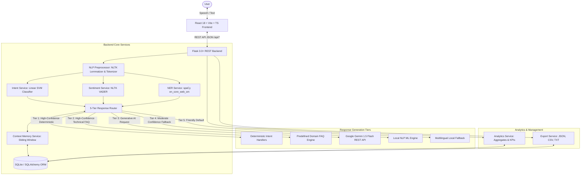
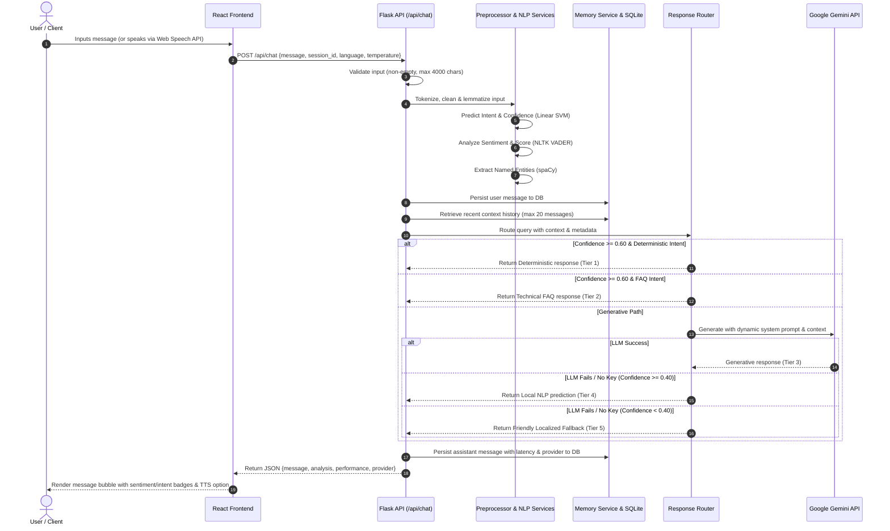
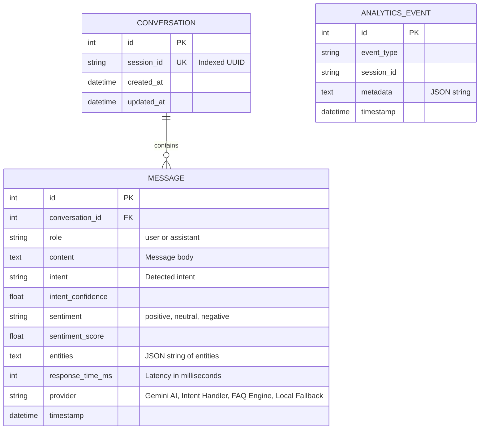
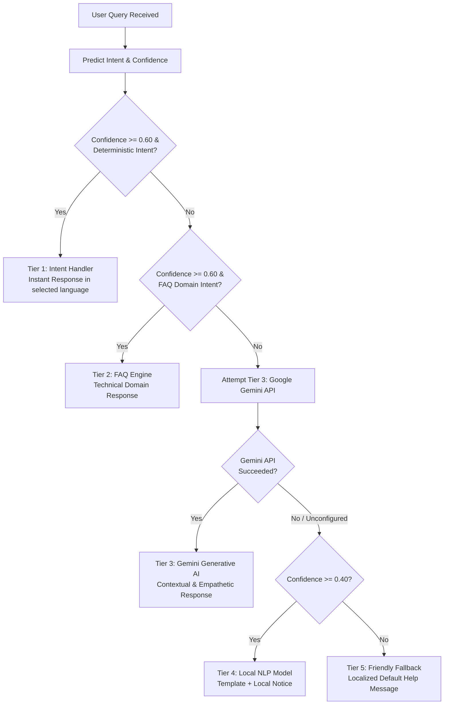

# Dynamic AI Chatbot - System Architecture & Technical Specification

## 1. System Overview

The **Dynamic AI Chatbot** is an enterprise-grade conversational AI platform built with a modern, decoupled micro-service architecture. It combines Natural Language Processing (NLP), Machine Learning (ML) intent classification, Named Entity Recognition (NER), Sentiment Analysis, Contextual Conversation Memory, a 5-Tier Response Router, Google Gemini Generative AI, Multilingual Support (English, Hindi, Hinglish), Browser-based Voice I/O, an Analytics Dashboard, and a modern React + TypeScript + Tailwind CSS interface.

---

## 2. End-to-End Conversational Workflow

When a user submits a query through text input or speech recognition, the backend processes it through a strict analytical pipeline before routing to the optimal response generator:

---

## 3. Backend Architecture & Components

### 3.1 Security & Configuration Layer (`backend/config.py`)
- **Zero Secrets Mandate**: API keys (`GOOGLE_API_KEY`), secret keys (`SECRET_KEY`), and database connection parameters are loaded via `python-dotenv` from `.env`.
- **Environment Fallback**: If `GOOGLE_API_KEY` is not present, the application operates in 100% offline local fallback mode without throwing exceptions or crashing.
- **Configurable Limits**:
  - `MAX_MESSAGE_LENGTH = 4000`: Protects backend from oversized prompt buffer exhaustion.
  - `MAX_CONTENT_LENGTH = 1048576`: 1 MB HTTP payload ceiling preventing denial-of-service memory spikes.
  - `INTENT_CONFIDENCE_THRESHOLD = 0.60`: Threshold separating deterministic intent execution from generative routing.
  - `MAX_CONTEXT_MESSAGES = 20`: Context window boundary preventing context bloat.

### 3.2 Database Layer (`backend/database.py`, `backend/models/`)
The database uses SQLAlchemy with SQLite (`backend/chatbot.db`), with support for external relational databases (PostgreSQL, MySQL) via `DATABASE_URL`.

### 3.3 NLP Pipeline (`backend/nlp/`, `backend/services/`)
1. **Preprocessor (`backend/nlp/preprocessor.py`)**:
   - Tokenization via `nltk.word_tokenize`.
   - Lowercasing and whitespace normalization.
   - Punctuation stripping with alphanumerical retention.
   - Lemmatization via `nltk.WordNetLemmatizer` (mapping nouns, verbs, adjectives).
2. **Intent Recognition (`backend/services/intent_service.py`)**:
   - TF-IDF Vectorization with unigrams and bigrams (`ngram_range=(1, 2)`), sublinear TF scaling.
   - Linear SVM classifier (`SGDClassifier(loss='log_loss', penalty='l2')`).
   - Calibrated probability estimates for confidence scoring.
   - Multi-language localized response dictionary for deterministic intents in English, Hindi, and Hinglish.
3. **Sentiment Analysis (`backend/services/sentiment_service.py`)**:
   - NLTK VADER (`SentimentIntensityAnalyzer`).
   - Generates compound score normalized to `[-1.0, 1.0]` and rescaled to `[0.0, 1.0]`.
   - Discrete classification: Positive (compound >= 0.05), Negative (compound <= -0.05), Neutral (otherwise).
   - Generates empathetic tone prefixes (e.g., "I'm sorry to hear that. Let me help you with this:") when negative user sentiment is detected.
4. **Named Entity Recognition (`backend/services/ner_service.py`)**:
   - spaCy `en_core_web_sm` pipeline.
   - Extracts `PERSON`, `ORG`, `GPE`, `DATE`, `TIME`, `MONEY`, `PRODUCT`, `EVENT`.
   - Rule-based regex fallback for email addresses, dates, and currency when spaCy is unavailable.
5. **Context Memory (`backend/services/memory_service.py`)**:
   - Chronological sliding window retrieving up to `MAX_CONTEXT_MESSAGES=20`.
   - Preserves multi-turn state across user interactions.

### 3.4 5-Tier Response Router Hierarchy (`backend/services/response_router.py`)

---

## 4. Frontend Architecture (`frontend/src/`)

The user interface is built as a single-page React 18 application with Vite, TypeScript, and Tailwind CSS.

### Component Structure
- **`App.tsx`**: Application state controller, theme manager (`light` / `dark` / `system`), active modal coordinator.
- **`Header.tsx`**: Navigation bar, live backend health status badge, language switcher dropdown, analytics toggle, settings button.
- **`ChatContainer.tsx`**:
  - `MessageList.tsx`: Auto-scrolling feed of conversation messages with date separators.
  - `MessageItem.tsx`: Role avatar (Bot/User), message text, copy button, Text-to-Speech button, regenerate button, intent badge with confidence %, sentiment badge, entity tags, latency badge, and provider tag.
  - `QuickSuggestions.tsx`: Suggested starter queries ("Explain Machine Learning", "What can you do?", "Help with Python", "Analyze my sentiment").
  - `ChatInput.tsx`: Auto-resizing textarea, Enter-to-send (Shift+Enter for newline), speech recognition toggle with live listening animation, clear chat, and export triggers.
- **`AnalyticsDashboard.tsx`**:
  - 5 KPI summary cards: Total Conversations, Total Messages, Avg Response Time, API Success Rate, Fallback Rate.
  - 6 Recharts interactive visualizations:
    1. Messages over Time (Area Chart)
    2. Sentiment Distribution (Pie Chart with Legend)
    3. Top Intent Distribution (Bar Chart)
    4. Response Time Latency Trend (Line Chart)
    5. Provider Call Distribution (Bar / Pie Chart)
    6. Multilingual Usage Distribution (Donut Chart)
- **`AppSettingsModal.tsx`**:
  - Theme mode selector (Light, Dark, System).
  - Language selector (English, Hindi, Hinglish).
  - AI Creativity Temperature slider (`0.1` - `1.0`).
  - Feature toggles: Timestamps, Sentiment Badges, Sound Effects.
  - Quick action buttons: Clear Chat, Export Chat (JSON, CSV, TXT).

### Voice Architecture (`useVoice.ts`)
- **Speech-to-Text (STT)**: Uses browser `webkitSpeechRecognition` / `SpeechRecognition` with dynamic language mapping (`en-US`, `hi-IN`). Microphone access is entirely optional; if unsupported or denied, a dismissible alert banner appears without crashing the UI.
- **Text-to-Speech (TTS)**: Uses `window.speechSynthesis` with text cleaning (strips markdown formatting characters) to read bot responses aloud in the active language.

---

## 5. Security & Isolation Architecture

1. **Input Sanitization**: Strings stripped of invalid controls, max character length of 4000 enforced at endpoint entry.
2. **Payload Ceiling**: Flask `MAX_CONTENT_LENGTH` set to 1 MB.
3. **ORM Parameterization**: 100% of database queries execute through SQLAlchemy ORM parameter binding, eliminating SQL injection.
4. **XSS Protection**: React virtual DOM automatically escapes all text nodes. `dangerouslySetInnerHTML` is completely forbidden across the frontend codebase.
5. **No Secret Leakage**:
   - `GOOGLE_API_KEY` never returned in HTTP responses or bundled in client scripts.
   - Uncaught exceptions caught by custom error handlers returning clean JSON without stack traces.
6. **CORS Isolation**: Configurable `CORS_ORIGINS` environment variable allowing explicit origin whitelists.
